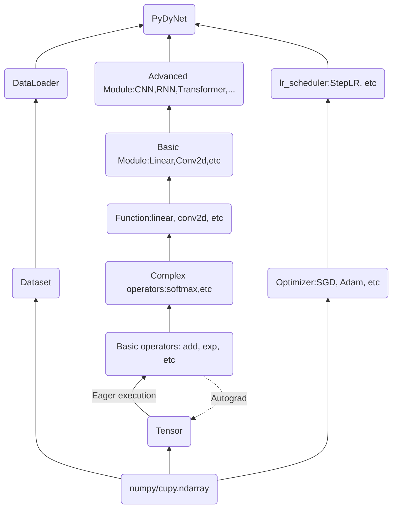
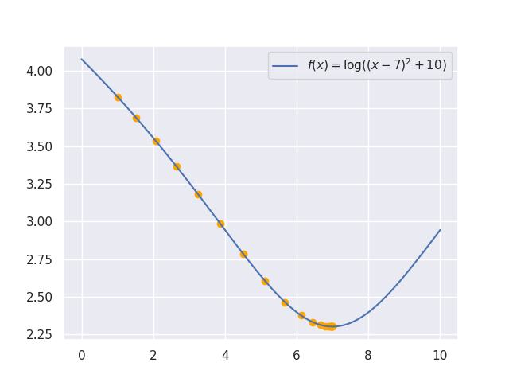
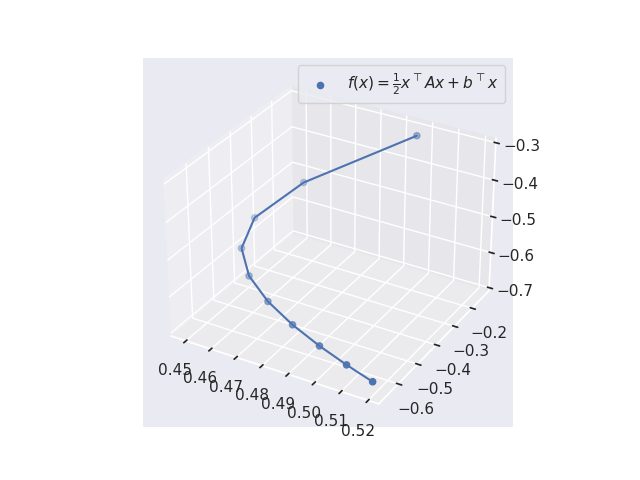
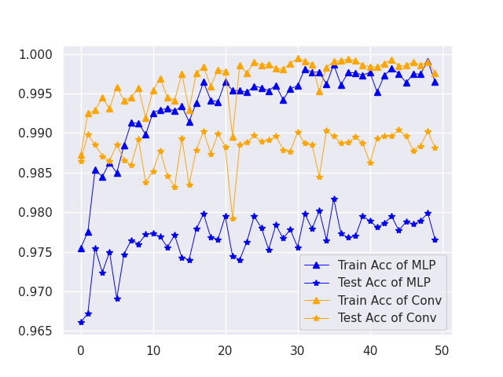
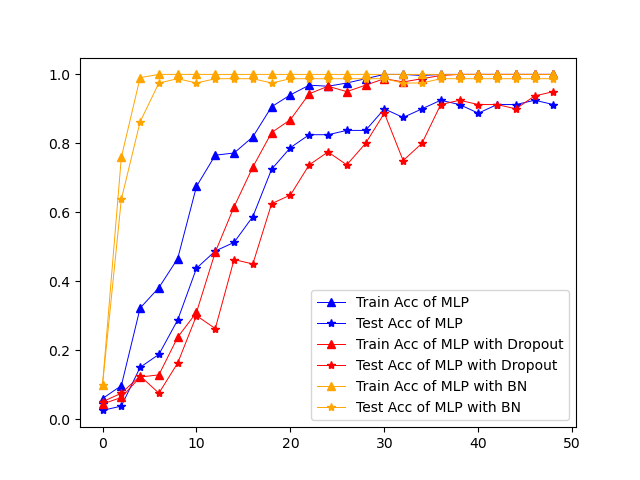
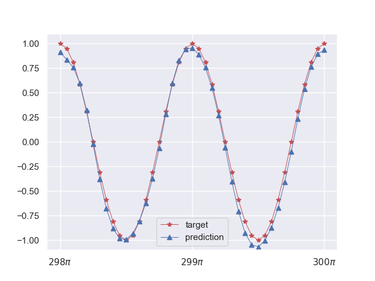
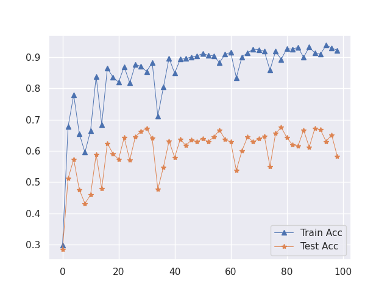

# PyDyNet：DL Framework (MLP, CNN, RNN, Transformer, ...) implementation using Numpy

前作：[PyNet: Use NumPy to build neuron network](https://github.com/Kaslanarian/PyNet)。在那里我们基于求导规则实现了全连接网络。在这里，我们向当今的深度学习框架看齐，实现属于自己的DL框架。

**PyDyNet已被多个技术公众号和社区分享**：[居然用Numpy实现了一个深度学习框架](https://segmentfault.com/a/1190000042108301).

[](https://pepy.tech/project/pydynet)
[](https://pepy.tech/project/pydynet)


## Towards Large Language Model

**2025.8.12**: 实现了纯推理的llama3. 参考了[这里](https://github.com/likejazz/llama3.np)的NumPy实现和数据集. 将数据集下载到`llama`文件夹即可运行:
```bash
>>> python .\llama\infer.py
There was a boy named Timmy. He loved to play with hi toy and run around outside. One day, Timmy' mom asked him to help her with the laundry. Timmy didn't want to help because he wanted to play. But hi mom said, "Timmy, you need to help me. It' important to help out."
Timmy didn't want to help, but he knew he had to. So, he put on hi shoe and went outside to help hi mom. A they were folding the laundry, Timmy saw a big pile of clothe on the ground. He wanted to play with them, but he knew he had to help hi mom.
After they finished folding the laundry, Timmy' mom said, "Thank you for helping me, Timmy. You did a great job!" Timmy felt proud of himself for helping hi mom and he realized that sometime it' important to help out, even if it mean doing something you don't want to do.

Token count: 223, elapsed: 0.99s, 225 tokens/s
```

## Overview

PyDyNet也是纯NumPy(0.0.7版本后加入CuPy，其用法和NumPy一致)实现的神经网络，语法受PyTorch的启发，大致结构如下：



虚线表示用户可以通过`no_grad`来关闭自动微分功能. 我们实现了：

1. 将NumPy数组包装成具有梯度等信息的张量(Tensor):
   <details><summary>Example</summary>
   <p>

   ```python
   from pydynet import Tensor

   x = Tensor(1., requires_grad=True)
   print(x.data) # 1.
   print(x.ndim, x.shape, x.is_leaf) # 0, (), True
   ```
   </p>
   </details>

2. 将NumPy数组的计算(包括数学运算、切片、形状变换等)抽象成基础算子(Basic operators)，并对部分运算加以重载：
   <details><summary>Example</summary>
   <p>

   ```python
   import pydynet as pdn

   x = pdn.Tensor([1, 2, 3])
   y = pdn.exp(x) + x
   z = pdn.sum(x)
   print(z.data) # 36.192...
   ```
   </p>
   </details>

3. 手动编写基础算子的梯度，实现和PyTorch相同的动态图自动微分机制(Autograd)，从而实现反向传播
   <details><summary>Example</summary>
   <p>

   ```python
   import pydynet as pdn
   from pydynet import Tensor

   x = Tensor([1., 2., 3.], requires_grad=True)
   y = pdn.log(x) + x
   z = pdn.sum(y)

   z.backward()
   print(x.grad) # [2., 1.5, 1.33333333]
   ```
   </p>
   </details>

4. 基于基础算子实现更高级的算子(Complex operators)，它们不再需要手动编写导数：
   <details><summary>Example</summary>
   <p>

   ```python
   import pydynet as pdn

   def simple_sigmoid(x: pdn.Tensor):
       return 1 / (1 + pdn.exp(-x))
   ```
   </p>
   </details>

5. 实现了Mudule，包括激活函数，损失函数等，从而我们可以像下面这样定义神经网络，损失函数项：
   <details><summary>Example</summary>
   <p>

   ```python
   import pydynet.nn as nn
   import pydynet.nn.functional as F

   n_input = 64
   n_hidden = 128
   n_output = 10

   class Net(nn.Module):
       def __init__(self) -> None:
           super().__init__()
           self.fc1 = nn.Linear(n_input, n_hidden)
           self.fc2 = nn.Linear(n_hidden, n_output)

       def forward(self, x):
           x = self.fc1(x)
           x = F.sigmoid(x)
           return self.fc2(x)

   net = Net()
   loss = nn.CrossEntropyLoss()
   l = loss(net(X), y)
   l.backward()
   ```
   </p>
   </details>

6. 实现了多种优化器和学习率衰减策略，从而实现神经网络的训练；其中优化器和PyTorch一样支持权值衰减，即正则化：
   <details><summary>Example</summary>
   <p>

   ```python
   from pydynet.optim import Adam, StepLR

   ...
   net = Net()
   optimizer = Adam(net.parameters(), lr=0.01)
   lr_scheduler = StepLR(optimizer, step_size=10)

   for epoch in range(EPOCHES):
       for data in data_loader:
           train(...)
           optimizer.step()
       lr_scheduler.step()
   ```
   </p>
   </details>
7. 实现了Dataset和DataLoader对数据集进行加载与划分：
   <details><summary>Example</summary>
   <p>

   ```python
   from pydynet.data import Dataset, DataLoader
   
   class TrainSet(Dataset):
       def __init__(self, X, y) -> None:
           self.data = X
           self.target = y

       def __getitem__(self, index):
           return self.data[index], self.target[index]

       def __len__(self):
           return len(self.data)

    data_loader = DataLoader(TrainSet(X, y), batch_size, shuffle)
   ```
   </p>
   </details>
8. Dropout机制，Batch Normalization机制，以及将网络划分成训练阶段和评估阶段；
9. 基于im2col高效实现Conv1d, Conv2d, max_pool1d和max_pool2d，从而实现CNN；
10. 支持多层的**多层双向**RNN，LSTM和GRU；
11. 多种初始化方式，包括Kaiming和Xavier；
12. 基于cupy实现了显卡计算和训练：
    <details><summary>Example</summary>
    <p>

    ```python
    from pydynet import Tensor
       
    x = Tensor([1., 2., 3.], device='cuda')
    y = Tensor([1., 2., 3.], device='cuda')
    z = (x * y).sum()

    w = Tensor([1., 2., 3.]) # CPU上的Tensor
    x * w # 报错
    ```
    </p>
    </details>

## Install

```bash
pip install pydynet
```

或本地安装

```bash
git clone https://github.com/Kaslanarian/PyDyNet
cd PyDyNet
python setup.py install
```

## Example

[tests](./tests)中是一些例子。运行`python tests/XXX.py`即可:

### AutoDiff

[autodiff1d.py](tests/autodiff1d.py)利用自动微分，对一个一维凸函数进行梯度下降：



以及一个多元凸函数的例子: [autodiff2d.py](tests/autodiff2d.py)




### MLP & LeNet

[mlp_cnn.py](tests/mlp_cnn.py)使用全连接网络(三层+残差)和LeNet对MNIST进行分类. 训练准确率和测试准确率：



### Dropout & BN

[mlp_dropout_bn.py](tests/mlp_dropout_bn.py)使用三种网络对`fetch_olivetti_faces`人脸(64×64)数据集进行分类并进行性能对比：

1. 三层MLP;
2. 三层MLP + Dropout;
3. 三层MLP + BatchNormalization.

学习效果对比：



### RNN

[rnn_sin.py](tests/rnn_sin.py)中是一个用RNN从$x=\sin(z)$学习$y=\cos(2z)$例子. 最后的训练结果:



### Transformer

[transformer.py](tests/transformer.py)中是一个用Transformer训练文本分类模型的例子. 训练结果:



> 数据集 (CoLA) 链接: <https://nyu-mll.github.io/CoLA/cola_public_1.1.zip>

## cuda加速

在训练batch size为128, 测试batch size为512情况下，模型在CPU和GPU上的训练速度比较:

|         Net         |      Dataset      | CPU time (s) per Epoch | GPU time (s) per Epoch |
| :-----------------: | :---------------: | :--------------------: | :--------------------: |
|     ResidualMLP     | MNIST (80000×574) |      20.256±0.138      |       2.903±.018       |
|        LeNet        | MNIST (80000×574) |     239.664±2.108      |      10.148±0.026      |
| 1-layer Transformer | CoLA (8551×45×64) |      17.503±0.251      |      1.125±0.002       |

设备: Nvidia GeForce RTX 3090.
