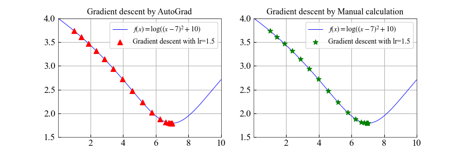

# PyDyNet：DL Framework (MLP, CNN, RNN, Transformer, ...) implementation using Numpy

前作：[PyNet: Use NumPy to build neuron network](https://github.com/Kaslanarian/PyNet)。在那里我们基于求导规则实现了全连接网络。在这里，我们向当今的深度学习框架看齐，实现属于自己的DL框架。

**PyDyNet已被多个技术公众号和社区分享**：[居然用Numpy实现了一个深度学习框架](https://segmentfault.com/a/1190000042108301).

[](https://pepy.tech/project/pydynet)
[](https://pepy.tech/project/pydynet)


## Towards Large Language Model

**2025.8.12**: 实现了纯推理的llama3 (6-layer Transformer, vocab-size=32000). 参考了[这里](https://github.com/likejazz/llama3.np)的NumPy实现和数据集. 将数据集下载到`llama`文件夹即可运行:

```bash
>>> python -m llama.infer
There was a boy named Timmy. He loved to play with hi toy and run around outside. One day, Timmy' mom asked him to help her with the laundry. Timmy didn't want to help because he wanted to play. But hi mom said, "Timmy, you need to help me. It' important to help out."
Timmy didn't want to help, but he knew he had to. So, he put on hi shoe and went outside to help hi mom. A they were folding the clothe, Timmy saw a big pile of laundry on the floor. He wanted to help, so he started to pick it up. But then, he accidentally knocked over a pile of clothe and they fell on him. Timmy wa okay, but he felt bad.
Hi mom saw what happened and said, "Timmy, you need to be more careful. You could have hurt yourself." Timmy felt bad and said sorry. Hi mom hugged him and said, "It' okay, accident happen. Let' clean up the laundry together." Timmy learned that it' important to be careful and help out when you need it.

Token count: 262, elapsed: 0.87s, 300 tokens/s
```

## Overview

PyDyNet也是纯NumPy(0.0.7版本后加入CuPy，其用法和NumPy一致)实现的神经网络，语法受PyTorch的启发，大致结构如下：


虚线表示用户可以通过`no_grad`来关闭自动微分功能.

## Install

```bash
git clone https://github.com/Kaslanarian/PyDyNet
cd PyDyNet
python setup.py install
```

## Example

[examples/pydynet](./examples/pydynet)中是一些例子，[examples/pytorch](./examples/pytorch)给出等价的pytorch实现. 运行`python examples.pydynet.xxx`即可:

### AutoDiff

[autodiff1d.py](examples/pydynet/autodiff1d.py)利用自动微分，对一个一维凸函数进行梯度下降：



以及一个多元凸函数的例子: [autodiff2d.py](examples/pydynet/autodiff2d.py)


### MLP & LeNet

[mlp_cnn.py](examples/pydynet/mnist.py)使用MLP和LeNet对MNIST进行分类. 训练准确率和测试准确率：


### Dropout & BN

[mlp_dropout_bn.py](examples/pydynet/dropout_bn.py)使用三种网络对`fetch_olivetti_faces`人脸(64×64)数据集进行分类并进行性能对比：

1. 三层MLP;
2. 三层MLP + Dropout;
3. 三层MLP + BatchNormalization.

学习效果对比：


### RNN

[rnn_sin.py](examples/pydynet/ts_prediction.py)中是一个用GRU做时序预测例子:


### Transformer

[transformer.py](examples/pydynet/transformer.py)中是一个用Transformer训练文本分类模型的例子. 训练结果:


> 数据集 (CoLA) 链接: <https://nyu-mll.github.io/CoLA/cola_public_1.1.zip>

## cuda加速

在训练batch size为256, 测试batch size为1024情况下，模型在CPU和GPU上的训练速度比较:

|      Network structure         |      Dataset      | CPU time (s) per epoch | GPU time (s) per epoch |
| :-----------------: | :---------------: | :--------------------: | :--------------------: |
|    3-layer MLP     | MNIST (80000×574) |      7.256±0.138      |       1.203±.0181       |
|        LeNet        | MNIST (80000×574) |     239.664±2.108      |      2.841±0.026      |
| 1-layer Transformer (dim=512, head=4) | CoLA (8551×45×64) |      17.503±0.251      |      1.075±0.002       |

设备: Nvidia GeForce RTX 4090.
